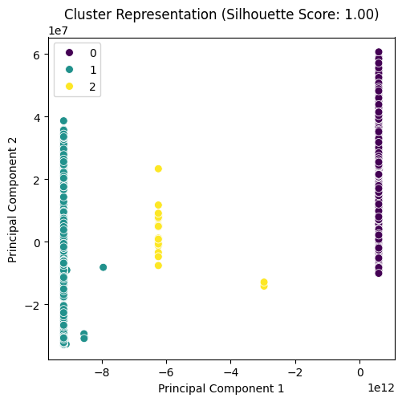
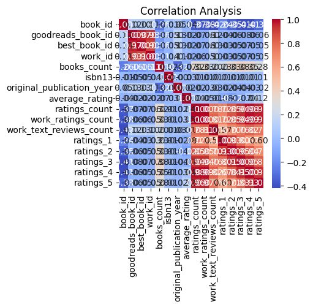
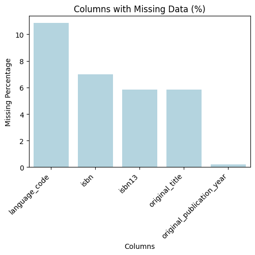

# Analysis Report

## Dataset Overview

    Dataset Summary:
    Total records: 10000
    Total fields: 24
    Column names: book_id, goodreads_book_id, best_book_id, work_id, books_count, isbn, isbn13, authors, original_publication_year, original_title, title, language_code, average_rating, ratings_count, work_ratings_count, work_text_reviews_count, ratings_1, ratings_2, ratings_3, ratings_4, ratings_5, image_url, small_image_url, Cluster_Group

    Missing Values:
    language_code                10.84
isbn                          7.00
isbn13                        5.85
original_title                5.85
original_publication_year     0.21
dtype: float64

    Correlation Details:
                                book_id  goodreads_book_id  best_book_id   work_id  ...  ratings_2  ratings_3  ratings_4  ratings_5
book_id                    1.000000           0.115154      0.104516  0.113861  ...  -0.345764  -0.413279  -0.407079  -0.332486
goodreads_book_id          0.115154           1.000000      0.966620  0.929356  ...  -0.056571  -0.075634  -0.063310  -0.056145
best_book_id               0.104516           0.966620      1.000000  0.899258  ...  -0.049284  -0.067014  -0.054462  -0.049524
work_id                    0.113861           0.929356      0.899258  1.000000  ...  -0.051367  -0.066746  -0.054775  -0.046745
books_count               -0.263841          -0.164578     -0.159240 -0.109436  ...   0.334923   0.383699   0.349564   0.279559
isbn13                    -0.011291          -0.048246     -0.047253 -0.039320  ...   0.010345   0.012142   0.010161   0.006622
original_publication_year  0.049875           0.133790      0.131442  0.107972  ...  -0.038472  -0.042459  -0.025785  -0.015388
average_rating            -0.040880          -0.024848     -0.021187 -0.017555  ...  -0.115875  -0.065237   0.036108   0.115412
ratings_count             -0.373178          -0.073023     -0.069182 -0.062720  ...   0.845949   0.935193   0.978869   0.964046
work_ratings_count        -0.382656          -0.063760     -0.055835 -0.054712  ...   0.848581   0.941182   0.987764   0.966587
work_text_reviews_count   -0.419292           0.118845      0.125893  0.096985  ...   0.696880   0.762214   0.817826   0.764940
ratings_1                 -0.239401          -0.038375     -0.033894 -0.034590  ...   0.926140   0.795364   0.672986   0.597231
ratings_2                 -0.345764          -0.056571     -0.049284 -0.051367  ...   1.000000   0.949596   0.838298   0.705747
ratings_3                 -0.413279          -0.075634     -0.067014 -0.066746  ...   0.949596   1.000000   0.952998   0.825550
ratings_4                 -0.407079          -0.063310     -0.054462 -0.054775  ...   0.838298   0.952998   1.000000   0.933785
ratings_5                 -0.332486          -0.056145     -0.049524 -0.046745  ...   0.705747   0.825550   0.933785   1.000000

[16 rows x 16 columns]

    Outliers Found:
    {'book_id': 0, 'goodreads_book_id': 345, 'best_book_id': 357, 'work_id': 601, 'books_count': 844, 'isbn13': 556, 'original_publication_year': 1031, 'average_rating': 158, 'ratings_count': 1163, 'work_ratings_count': 1143, 'work_text_reviews_count': 1005, 'ratings_1': 1140, 'ratings_2': 1156, 'ratings_3': 1149, 'ratings_4': 1131, 'ratings_5': 1158}

    Cluster Analysis:
    Cluster_Group
0    9382
1     594
2      24
Name: count, dtype: int64
    

## Additional Insights
Based on the provided insights from the dataset, here are some additional analysis steps you can consider to further explore and derive actionable insights:

### 1. **Handling Missing Values**
   - **Imputation Techniques**: Develop a strategy for imputation of missing values in the `language_code`, `isbn`, `isbn13`, and `original_title` columns. Techniques can include:
     - Mode imputation for categorical variables (`language_code`).
     - Median or mean imputation for numeric fields if appropriate.
     - Advanced methods like KNN or regression-based imputation for any numeric fields.
   - **Impact Analysis**: Analyze how the imputation of missing values affects key metrics like average ratings or ratings counts.

### 2. **Exploratory Data Analysis (EDA)**
   - **Univariate Analysis**: Conduct an analysis of individual fields:
     - Distribution of ratings (e.g., histograms of `average_rating` and `ratings_count`).
     - Trends based on `original_publication_year`.
   - **Bivariate Analysis**: Study the relationships between important pairs of variables:
     - Examine the relationship between `average_rating` and `ratings_count`.
     - Explore how `work_text_reviews_count` contributes to `average_rating`.

### 3. **Investigating Correlation further**
   - **Focus on Strong Correlations**: Dive deeper into highly correlated fields (e.g., `work_ratings_count` and `ratings_count`) to understand their implications and perhaps consolidate them if redundancy is evident.
   - **Multicollinearity Check**: Assess if certain features lead to multicollinearity issues which can obscure the interpretation of regression models.

### 4. **Outlier Analysis**
   - **Exploration of Outlier Impact**: Investigate how the identified outliers affect overall averages and distributions. Consider performing:
     - Removal or transformation of outliers and then re-evaluating metrics.
     - Visualizations (e.g., box plots) for clear representation of outlier effect.

### 5. **Cluster Analysis Validation**
   - **Examine Clusters**: Provide insights on what distinguishes each cluster (`Cluster_Group`). Consider further segmentation or profiling:
     - Analyze attributes across clusters (average ratings, unique authors, publication years).
     - Validate the appropriateness of the chosen clustering algorithm (e.g., K-Means) and consider alternative methods (DBSCAN, Hierarchical Clustering).
   - **Cluster Characteristics**: Identify which variables contribute most to each cluster and understand member characteristics.

### 6. **Predictive Modeling**
   - **Rating Prediction Model**: Build a predictive model (e.g., linear regression, random forest, or gradient boosting) to forecast `average_rating` based on other features such as `ratings_count`, `work_ratings_count`, and `books_count`. Assess model performance and feature importance.
   - **Recommendation System**: If applicable, explore collaborative filtering or content-based filtering to create a book recommendation system based on user ratings and book characteristics.

### 7. **Temporal Analysis**
   - **Publication Year Trends**: Analyze `original_publication_year` to see if certain years show a trend in the average ratings or the number of ratings, indicating trends in reader preferences over time.
   - **Impact of Recent Publications**: Investigate if books published in more recent years have different patterns in ratings and reviews compared to older publications.

### 8. **Visualization**
   - **Data Visualization Tools**: Implement visual tools and libraries (like Seaborn or Matplotlib) to create clear visualizations for your analysis. 
   - **Interactive Dashboards**: Develop interactive dashboards using tools like Tableau, Power BI, or Plotly Dash, to allow stakeholders to explore insights dynamically.

### 9. **Comparative Analysis**
   - **External Benchmarks**: If possible, compare your dataset metrics with industry benchmarks or data from other similar datasets to establish performance against peers.
   - **Response to Market Changes**: Analyze historical data for correlation to major industry changes (like new platforms or changes in reader behavior) to understand shifts in book ratings.

### 10. **Reporting Insights**
   - **Comprehensive Report**: Compile your findings into a structured report highlighting key insights, methodologies, visualizations, and actionable recommendations. Ensure clarity and accessibility for non-technical stakeholders.

By following these steps, you can deepen the insights gathered from the dataset and derive more meaningful conclusions that can inform decision-making, strategy development, or operational improvements in your context.

## Plots

## Summary
**Title: The Gift of Kindness**

In the heart of a bustling city lived a woman named Clara. At fifty, her life had been a tapestry woven with vibrant threads of dreams, hopes, and love. But over the years, the colors had dimmed, overshadowed by the tragic loss of her husband, Daniel. He had been her sun, her guiding light, always seeing beauty where others saw chaos. His sudden passing two years ago left a void in her heart that seemed impossible to fill.

Clara succumbed to her grief, retreating from the world, spending long days alone in their once lively home. The laughter that echoed off the walls faded into silence, and the vibrant colors of her life dulled to gray. As the months drifted by, she felt her connections with her friends and community fading as well. They tried reaching out, but Clara was trapped in her fortress of sadness.

One rainy afternoon, Clara discovered an old box while rummaging through the attic, a relic of memories filled with photographs and trinkets. Among these was a small wooden box that contained notes—love letters Daniel had written her during their courtship. Each note was filled with his unwavering belief in the power of kindness, urging her to "always find the beauty in others’ hearts."

Moved, Clara decided to step outside for the first time in months. As she walked through the park, the fresh scent of rain-soaked earth invigorated her. A small child caught her attention—he was trying to sell lemonade, his little stand adorned with colorful posters, but nobody was stopping. Clara, feeling a flicker of warmth in her heart, approached. 

“Can I have a cup?” she asked, her voice feeling alien after so long. The child’s face lit up, and they exchanged smiles. 

“Just one dollar, please!” he beamed with innocent joy.

Clara handed him a five-dollar bill. 

“Keep the change,” she said, and with that simple act of kindness, a spark of life returned to her chest. She walked away, sipping the lemonade, the sweet and tart taste reminding her of homemade summer days. 

Days turned into weeks as Clara continued her tiny acts of kindness—sharing baked goods with her neighbors, volunteering at the local shelter, and helping the elderly get groceries. Each act opened the door a little wider to connections that had long been neglected. The people around her began to notice her transformation, and Clara found herself enveloped in a warm collective spirit, healing gradually from the inside out.

One evening, while organizing a community dinner at the shelter, Clara met a woman named Rosa. Like Clara, she too had experienced her share of grief and loss. They struck up a conversation, and as the night went on, their shared stories blended together, healing the remnants of pain through laughter and understanding. Clara felt her heart begin to bloom again, filled with the shared warmth of empathy.

Months passed, and as the first snow of winter fell, Clara found herself at a distant horizon of renewal. The community she once felt detached from had embraced her, and the love for Daniel had transformed into a tribute of kindness that honored his memory. 

On that snowy day, Clara stood outside her home, steaming mugs of hot cocoa in hand, ready to welcome friends and neighbors for a holiday gathering. The laughter and chatter that filled her home were not just sounds; they were a symphony of love—a celebration of life lived with kindness.

As Clara gazed around at the faces lit up with joy, she felt Daniel's spirit beside her, whispering encouragement in the soft winter wind. In that moment, she understood—life is not measured by the losses we bear but by the hearts we touch and the kindness we share. She smiled, her heart brimming with love and gratitude, knowing that she had truly come home. The cycle of kindness had renewed her spirit and gifted her a family—a community bound by shared healing and love. 

In the end, Clara discovered that each act of kindness, no matter how small, could light up the darkness, illuminating a path towards a brighter, hope-filled tomorrow.