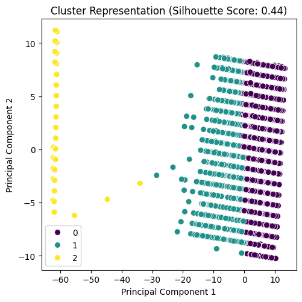
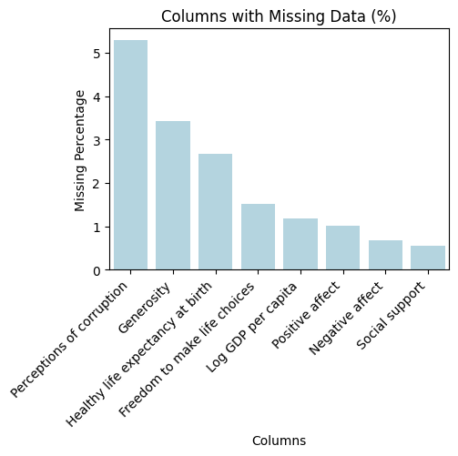

# Analysis Report

## Dataset Overview

    Dataset Summary:
    Total records: 2363
    Total fields: 12
    Column names: Country name, year, Life Ladder, Log GDP per capita, Social support, Healthy life expectancy at birth, Freedom to make life choices, Generosity, Perceptions of corruption, Positive affect, Negative affect, Cluster_Group

    Missing Values:
    Perceptions of corruption           5.289886
Generosity                          3.427846
Healthy life expectancy at birth    2.666102
Freedom to make life choices        1.523487
Log GDP per capita                  1.184934
Positive affect                     1.015658
Negative affect                     0.677105
Social support                      0.550148
dtype: float64

    Correlation Details:
                                          year  Life Ladder  ...  Positive affect  Negative affect
year                              1.000000     0.046846  ...         0.013052         0.207642
Life Ladder                       0.046846     1.000000  ...         0.515283        -0.352412
Log GDP per capita                0.080104     0.783556  ...         0.230868        -0.260689
Social support                   -0.043074     0.722738  ...         0.424524        -0.454878
Healthy life expectancy at birth  0.168026     0.714927  ...         0.217982        -0.150330
Freedom to make life choices      0.232974     0.538210  ...         0.578398        -0.278959
Generosity                        0.030864     0.177398  ...         0.300608        -0.071975
Perceptions of corruption        -0.082136    -0.430485  ...        -0.274208         0.265555
Positive affect                   0.013052     0.515283  ...         1.000000        -0.334451
Negative affect                   0.207642    -0.352412  ...        -0.334451         1.000000

[10 rows x 10 columns]

    Outliers Found:
    {'year': 0, 'Life Ladder': 2, 'Log GDP per capita': 1, 'Social support': 48, 'Healthy life expectancy at birth': 20, 'Freedom to make life choices': 16, 'Generosity': 39, 'Perceptions of corruption': 194, 'Positive affect': 9, 'Negative affect': 31}

    Cluster Analysis:
    Cluster_Group
0    1559
1     738
2      66
Name: count, dtype: int64
    

## Additional Insights
Based on the insights provided from the dataset, several additional analysis steps can be pursued to deepen the understanding of the relationships within the data and enhance the findings. Here are some proposed analysis steps:

### 1. **Imputation of Missing Values**
   - **Objective:** Handle the missing values in the dataset to ensure robust analysis. 
   - **Steps:** 
     - Consider different imputation methods (mean, median, mode, or predictive models) for columns with missing values.
     - Evaluate the impact of imputation on key relationships, particularly focusing on 'Perceptions of corruption' and 'Generosity', which have relatively high missing percentages.

### 2. **Advanced Correlation Analysis**
   - **Objective:** Explore non-linear relationships and interactions between variables.
   - **Steps:**
     - Use Spearman or Kendall correlation instead of Pearson to understand non-linear relationships.
     - Create scatter plots or pair plots for visual inspection of relationships between key variables such as 'Life Ladder', 'Log GDP per capita', and 'Social support'.

### 3. **Regression Analysis**
   - **Objective:** Identify the predictors of 'Life Ladder' (as a measure of well-being).
   - **Steps:**
     - Conduct a multiple linear regression analysis with 'Life Ladder' as the dependent variable and the other metrics as independent variables.
     - Consider interactions between significant predictors for deeper insight.
     - Evaluate the model using metrics such as R-squared and Adjusted R-squared.

### 4. **Outlier Analysis**
   - **Objective:** Investigate the outliers to understand their impact on the dataset and overall analysis.
   - **Steps:**
     - Analyze the context of the outliers in key variables to determine if they warrant special attention or exclusion.
     - Visualize the outliers using box plots or scatter plots to assess their influence on overall trends.

### 5. **Cluster Profiling**
   - **Objective:** Generate detailed profiles for each cluster identified in the Cluster Analysis.
   - **Steps:**
     - Summarize the mean, median, and other relevant statistics for key variables within each cluster.
     - Visualize differences between clusters with bar charts, heatmaps, or radar charts.
     - Analyze socio-economic and well-being characteristics of each cluster to draw actionable insights.

### 6. **Time Series Analysis**
   - **Objective:** Examine trends over time across various metrics.
   - **Steps:**
     - Perform time series analysis on metrics such as 'Life Ladder', 'Log GDP per capita', and 'Healthy life expectancy over the years.
     - Identify any seasonal trends, cycles, or long-term trends, and assess how they relate to global events or economic changes.

### 7. **Factor Analysis**
   - **Objective:** Identify latent variables that could explain the observed relationships among multiple variables.
   - **Steps:**
     - Conduct exploratory factor analysis (EFA) to group variables that exhibit similar behaviors.
     - Confirmatory Factor Analysis (CFA) could then be conducted to validate the factor structure.

### 8. **Predictive Modeling**
   - **Objective:** Utilize the dataset to build predictive models forecasting well-being indicators.
   - **Steps:**
     - Implement machine learning algorithms (e.g., decision trees, random forests) to predict 'Life Ladder' or other outcomes based on available features.
     - Evaluate model performance through techniques like cross-validation and compare results across different models to identify the best approach.

### 9. **Subgroup Analysis**
   - **Objective:** Investigate how well-being indicators vary among different demographic or geographic groups.
   - **Steps:**
     - Segment the dataset by regions, income brackets, or cultural factors to analyze patterns specific to those groups.
     - Visualize and interpret differences in well-being indicators across segments.

### 10. **Report and Visualization**
   - **Objective:** Summarize and communicate findings effectively.
   - **Steps:**
     - Create comprehensive dashboards using visualization tools (such as Tableau or Power BI) to convey complex insights clearly.
     - Prepare a detailed report summarizing the analysis, insights, and potential implications for stakeholders interested in improving well-being metrics.

By following these steps, you can extract richer insights from the dataset, uncover new patterns, and derive actionable strategies for addressing issues related to well-being.

## Plots

## Summary
**Title: A Flame of Kindness**

In a small village nestled between serene mountains, where the horizon kissed the sky at twilight, lived a humble woman named Mira. Known for her radiant smile and the warmth she exuded, Mira was often seen tending to her delicate flower garden, which bloomed with colors that rivaled the sunrise. Yet, beneath her cheerful demeanor lay a grief that shadowed her heart—a grief born from loss.

Years earlier, Mira had lost her beloved husband, Rohan, to a sudden illness that took him away when their twin daughters were just five years old. The days that followed were a blur of sorrow and solitude. As she navigated the depths of her despair, Mira realized that the grief weighed her spirit down like a heavy cloak, stifling the light she had once brought to the world and to her daughters, Tara and Leela.

In her darkest moments, Mira found solace in the small acts of kindness that she could provide to her neighbors and community. She volunteered at the local orphanage, sharing her gardening skills with children who had lost their families, teaching them to nurture the flowers and plants that she adored. 

One particularly rainy afternoon, Mira gathered a few children and led them to her garden. As they got their hands muddy planting seeds, laughter filled the air. Mira noticed a boy sitting apart, his eyes dimmed by a lingering sadness. His name was Arjun, and he had recently lost his parents. 

Sitting beside him, she shared stories about her husband, the laughter they found in everyday moments, and how each flower in her garden had its own story—a story of resilience and beauty amid sorrow. As the rain drizzled softly around them, a spark ignited in Arjun’s eyes, and he began to share memories of his parents with Mira. In doing so, the weight of his grief seemed to lift, if only for a moment, replaced by the light of connection and kindness.

Slowly, as the weeks turned into months, Mira found a profound purpose in her sorrow. The orphanage became her sanctuary. Children like Arjun lit the corners of her heart that grief had dimmed. She cheerfully organized community gatherings and flower markets, where local families would come together to buy plants, with proceeds going to the orphanage. Each flower sold became a symbol of hope, resilience, and community spirit.

As the village thrived, the sense of togetherness enveloped them, transcending their individual sorrows. Mira’s daughters often helped out, embodying the spirit of kindness instilled by their mother. 

One day, it was announced that a powerful storm would hit their village. The forecast brought panic among the villagers, but Mira organized a relief effort, ensuring each family had supplies. They worked hand-in-hand, creating shelters in the town hall and gathering food and blankets.

When the storm finally struck, it raged mercilessly, and it seemed all hope would be lost. However, the same spirit that thrived in each person's heart shone brighter than any storm. They took turns sheltering those in need, sharing stories, food, and kindness. 

When the storm subsided, the community came together to assess the damage. The sight was heart-wrenching, yet amidst the destruction lay a promise. Flowers from Mira’s garden had rooted deeply, resiliently pushing through the muddy ground. 

Mira, standing among her neighbors and friends, felt something shift within her. No longer merely a vessel of grief, she now understood that her pain had catalyzed connections that healed her soul and revitalized her community. In their unity, they began to plant a new garden, one that would blossom as a testament to hope and kindness. 

Months later, during the annual village festival, the garden stood vibrant and full of life. Flowers of all shapes and colors danced in the breeze, creating a mesmerizing tapestry against the setting sun. Mira stood with her daughters, hand-in-hand with Arjun, now glowing with joy. 

"I used to think that grief was the end," Mira reflected, voice filled with warmth, “but it taught me that kindness, like flowers, can grow from the darkest places.”

Filled with laughter and the spirit of collaboration, the village rejoiced, celebrating their journey from sorrow to triumph. As they danced and cherished one another, Mira's heart swelled with a profound sense of belonging and healing. 

And so, the once sorrow-laden garden bloomed anew, a living testament of connections forged through love, kindness, and the beauty of healing together.