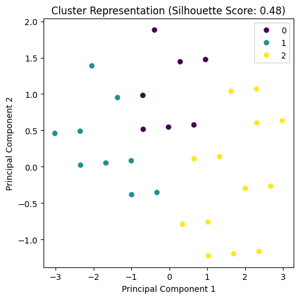
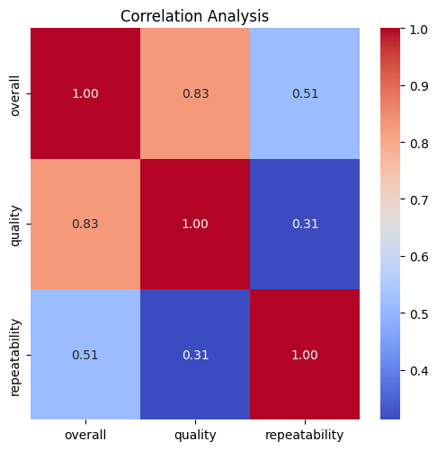
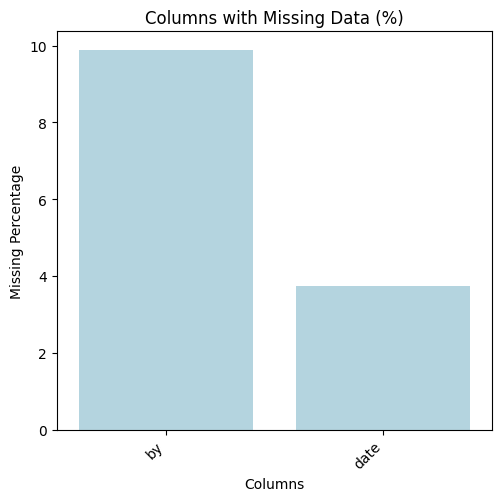

# Analysis Report

## Dataset Overview

    Dataset Summary:
    Total records: 2652
    Total fields: 9
    Column names: date, language, type, title, by, overall, quality, repeatability, Cluster_Group

    Missing Values:
    by      9.879336
date    3.733032
dtype: float64

    Correlation Details:
                    overall   quality  repeatability
overall        1.000000  0.825935       0.512600
quality        0.825935  1.000000       0.312127
repeatability  0.512600  0.312127       1.000000

    Outliers Found:
    {'overall': 1216, 'quality': 24, 'repeatability': 0}

    Cluster Analysis:
    Cluster_Group
2    1369
0     673
1     610
Name: count, dtype: int64
    

## Additional Insights
Based on the provided insights and the summary of the dataset, here are some additional analysis steps that can be undertaken to delve deeper into the data:

### 1. **Imputation of Missing Values:**
   - Since there are notable percentages of missing values for the `by` (9.88%) and `date` (3.73%) fields, consider implementing strategies for imputing these missing values. Possible approaches include:
     - For `by`: Filling missing values with the mode or by using machine learning algorithms to predict the missing entries based on other fields.
     - For `date`: Investigate patterns or trends in available dates to see if imputation using mean or median values makes sense based on the distribution.

### 2. **Outlier Investigation:**
   - Investigate the outlier in the `overall` field more closely. Since it has a significant number of outliers (1216), use visualizations (e.g., box plots) and statistical tests to understand their impact on the dataset. 
   - Evaluate whether the outliers warrant exclusion and analyze how their removal affects the correlation metrics with respect to `quality` and `repeatability`.

### 3. **Correlation Analysis Enhancements:**
   - Conduct further correlation analysis on all relevant numeric fields to identify any additional correlations or multicollinearity issues. Consider using heatmaps for better visualization.
   - Investigate categorical variables (`language`, `type`, `title`, `by`, `Cluster_Group`) against numerical fields to see if any categorical variable impacts the continuous variables meaningfully.

### 4. **Time Series Analysis:**
   - Analyze the `date` field for trends over time. Determine if there are any seasonality patterns, and averages for `overall`, `quality`, and `repeatability` by different time intervals (daily, weekly, monthly).
   - This can help identify any temporal factors that might influence the results, particularly if the `date` corresponds to specific events or trends.

### 5. **Cluster Group Analysis:**
   - Further analyze the three cluster groups to understand their characteristics. Examine the average values of `overall`, `quality`, and `repeatability` within each group.
   - Use visualizations (such as PCA for dimensionality reduction) to explore if the clusters can be further segmented or characterized meaningfully.

### 6. **Qualitative Analysis:**
   - For the `title` and `by` fields, consider performing a qualitative analysis to assess the content qualitatively. Natural Language Processing (NLP) techniques can help extract themes or sentiments from these text fields.

### 7. **Comparative Analysis:**
   - Compare the clusters against each other in terms of performance metrics like `overall`, `quality`, and `repeatability`. Look for significant differences that might suggest varying levels of performance or quality across clusters.

### 8. **Predictive Modeling:**
   - If the goal of this analysis is to make predictions, consider building regression models to predict `overall`, `quality`, and `repeatability` based on the other features in the dataset.
   - Compare different algorithms (e.g., linear regression, decision trees, or ensemble methods) to find the best predictive model.

### 9. **Visualization:**
   - Create comprehensive visualizations including:
     - Histograms for distribution analysis of numeric fields.
     - Bar charts for categorical fields.
     - Box plots for summary statistics and outlier detection by `Cluster_Group`.

### 10. **Hypothesis Testing:**
   - Conduct hypothesis tests (e.g., t-tests or ANOVA) to evaluate the significance of differences between cluster groups based on performance metrics.

By following these additional steps, you can glean much deeper insights and understand the characteristics and relationships within your data effectively.

## Plots

## Summary
**Title: The Colors of Resilience**

In the quaint little town of Maplewood, where autumn leaves danced in the gentle breeze, lived a woman named Clara. She was known for her vibrant spirit and a smile that could brighten even the gloomiest of days. Clara worked as a local artist, pouring her heart into every painting she created. Yet, behind her radiant exterior lay a heart heavy with grief.

Two years prior, Clara lost her husband, David, to a sudden illness. Their love was a tapestry, woven together by laughter, shared dreams, and an unwavering bond. After his passing, the colors faded from Clara’s world; her canvases sat untouched, the brushes gathering dust as she struggled to overcome the void left behind.

One chilly evening, while walking through the local park, Clara stumbled upon a group of children gathered around a small table. They were engrossed in crafting colorful paper lanterns for the upcoming festival. Their laughter was infectious, and it pulled Clara from her reverie, reminding her of the joy she once found in creating.

Summoning the remnants of her courage, Clara approached the children. “Mind if I join you?” she asked, her voice as soft as the twilight air.

With responsive smiles, the children welcomed her. As they worked alongside each other, Clara felt a spark igniting within her. They shared stories, dreams, and laughter, and in those innocent exchanges, Clara began to feel the warmth of connection gradually returning to her heart.

Days turned into weeks, and what began as a simple lantern-making session transformed into a small community project. Clara suggested they organize an art workshop for the children, teaching them to express themselves through painting and crafts. The children were thrilled, and soon the little community center buzzed with creative energy.

At first, Clara struggled to find her voice amid the vibrant chatter of the young artists. But gradually, she found herself rediscovering the joy of art. Painting alongside these spirited souls, she unveiled her emotions onto the canvas, translating grief into a beautiful symphony of colors. The children became her muses, their uninhibited imaginations rekindling the flame of creativity that had nearly dwindled away.

However, as the festival approached, the children began to prepare for their lantern designs. One evening, Clara was approached by a shy girl named Ella, her big eyes filled with uncertainty. “Miss Clara,” she said softly, “can you help me paint a lantern for my mommy? She’s been sad too.”

Clara knelt down, her heart aching for the little girl. “Of course, sweetheart. Let’s make it the brightest one.”

They spent hours painting together, the lantern blossoming with vibrant colors—a tribute to hope and resilience. The experience not only helped Ella express her love for her mother but also opened Clara’s heart further, reminding her that love transcends even the darkest moments.

The night of the festival arrived, and the town was awash with flickering lights and laughter. Clara and the children unveiled their lanterns; it was a sight to behold. Each one was unique, a heartfelt fusion of colors and stories, illuminating the night sky like a constellation of dreams.

As the lanterns floated away into the starry sky, Clara felt the weight of her grief lift. The shared experience, the laughter, and the love fostered in those tender moments had transformed her. Clara realized that while her love for David would always remain, she could carry his spirit forward by embracing life again and honoring the connections she had made.

With newfound strength, Clara opened her heart to the future, cherishing the beauty of resilience. In the warmth of her community, amidst the laughter of children and the glow of colorful lanterns, Clara found a sense of belonging. As she watched the lanterns dance away, she whispered a promise to David, knowing he was watching over her, proud of the love she had continued to share.

The colors of her life returned, painting a hopeful tomorrow where love, resilience, and community intertwined, reflecting the light of countless lanterns soaring toward infinity. In Maplewood, the heartbeats of connection outshined the shadows of loss, and Clara emerged as a luminary, lighting the way for others still lost in the dusk.